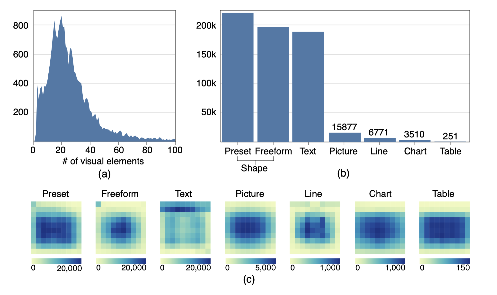

# Reverse-Engineering Information Presentations

To understand the layout of information presentations, we contribute a large-scale design dataset to the community. It includes 23,072 information presentations with 620,878 visual elements collected from the Internet. 

We chose PowerPoint files as the target file format to construct our dataset because they are the most commonly used information presentations. Each slide in the PPT file is an information presentation that consists of a set of graphical and textual elements. Furthermore, PPT files contain the actual spatial information for each visual element, which can be parsed by [an open-source tool](https://pypi.org/project/python-pptx).

We define the following four criteria to filter the slides:

- To ensure that visual elements of an information presentation are worth grouping, we ask that slides should have more than three visual elements.
- To ensure the diversity of layouts, we ask that slides should contain at least two visual groups.
- To ensure an information presentation is visually attractive and informative, we ask that slides should include both graphical and textual elements.
- The elements in the slide should be arranged in a well-organized structure. It also means the elements should form an intuitively regular pattern.

The following figure illustrates four negative cases that we removed from the dataset: (a) includes only three visual elements (one icon and two textual objects); (b) has no graphical elements; (c) just contains one visual group; (d) has a disorder layout. (e) and (f) are two positive cases in the dataset.


The average number of elements in each slide is 26.9. The following presents the distribution of the number of elements in our data collection. (a) The majority of the slides (83.7%) contain less than 40 elements. More than half of the slides have 10 to 30 visual elements (57.3%). (b) The distribution of element types in the dataset. (c) The spatial distributions of these seven element types on the normalized space. This demonstrates the diversity of our data collection in terms of layouts of visual elements.



In total, there are seven major types we extracted from our collection:

| Element Type | Count | Description |
|:--|:--|:--|
| *preset* | 216,300 | A *preset geometry* is a type of typical shapes provided by general design tools, such as a rectangle, a circle or a star. In detail, the most used preset geometry is rectangle (119,818) and the second is oval (56,560). |
| *freeform* | 192,673 | A *freeform shape* (192,673) is a user-defined shape which is composed of multiple paths. |
| *text* | 185,259 | A *text* is a text box which enable users to input text information. |
| *picture* | 15,887 | - |
| *line* | 6,771 | - |
| *chart* | 3,510 | - |
| *table* | 251 | - |

We extract related spatial features from each visual element:

- **Z-index**. Z-index indicates the order of elements in the z-axis. An element with a higher z-index is on top of another element with a lower z-index. We represent the z-index using a natural number. 
- **Position**. Position feature indicates the position of the element. We use the bounding box (𝑥1 , 𝑦1 ,𝑥2 , 𝑦2 ) to represent the position of the element, where (𝑥1 , 𝑦1 ) denotes the top left of the bounding box and (𝑥2 , 𝑦2 ) denotes the bottom right. We adopt the normalized parameters by scaling (𝑥1 , 𝑦1 ,𝑥2 , 𝑦2 ) to the range of [0, 1].
- **Size**. Size feature (𝑤,ℎ) is the normalized width and height of a visual element. Although this feature can be computed by the position feature, we explicitly represent this feature to help the computer understand this relationship more easily.
- **Rotation**. Rotation feature indicates the degrees of clockwise rotation of the element ranged from 0 to 360.
- **Alignment**. Alignment feature is a text-specific feature as a text can be aligned in vertical and horizontal direction. It includes two attributes for vertical alignment (top, middle, bottom, and mixed aligned) and horizontal alignment (left, right, center, and mixed aligned).

For more detail, please check our paper ([https://link.springer.com/article/10.1007/s44267-023-00010-1](https://link.springer.com/article/10.1007/s44267-023-00010-1)).


```
Shi, D., Cui, W., Huang, D. et al. Reverse-engineering information presentations: recovering hierarchical grouping from layouts of visual elements. Vis. Intell. 1, 9 (2023). https://doi.org/10.1007/s44267-023-00010-1
```