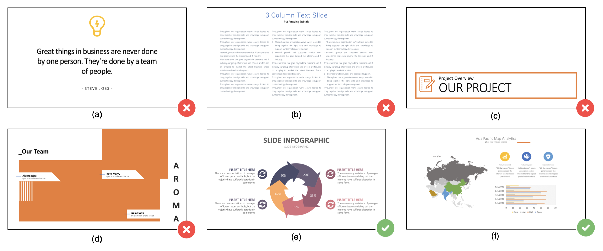

# Reverse-Engineering Information Presentations

To understand the layout of information presentations, we contribute a large-scale design dataset to the community. It includes 23,072 information presentations with 620,878 visual elements collected from the Internet. 

We choose PowerPoint files as the target file format to construct our dataset. Because PPTs are the most commonly used information presentations in our daily life. Each slide in the PPT file is an information presentation that consists of a set of graphical and textual elements with corresponding features. Furthermore, PPT files contain the actual spatial information for each visual element, which can be parsed by [the open-source tool](https://pypi.org/project/python-pptx).

We selected the proper information presentations according to 4 rules: (1) It should contain more than three visual elements; (2) It should not only have graphical elements or textual elements; (3) It should contain at least two visual groups; (4) The elements in the slide are arranged in a well-organized structure. The following figure illustrates four negative cases that we removed from the dataset: (a) includes only three visual elements (one icon and two textual objects); (b) has no graphical elements; (c) just contains one visual group; (d) has a disorder layout. (e) and (f) are two positive cases involved in our dataset.



The average number of elements in each slide is 26.9. The following presents the distribution of the number of elements in our data collection. (a) The majority of the slides (83.7%) contain less than 40 elements. More than half of the slides have 10 to 30 visual elements (57.3%). (b) The distribution of element types in the dataset. (c) The spatial distributions of these seven element types on the normalized space. This demonstrates the diversity of our data collection in terms of layouts of visual elements.


In total, there are seven major types we extracted from our collection:

| Element Type | Count | Description |
|:--|:--|:--|
| *preset* | 216,300 | A *preset geometry* is a type of typical shapes provided by general design tools, such as a rectangle, a circle or a star. In detail, the most used preset geometry is rectangle (119,818) and the second is oval (56,560). |
| *freeform* | 192,673 | A *freeform shape* (192,673) is a user-defined shape which is composed of multiple paths. |
| *text* | 185,259 | A *text* is a text box which enable users to input text information. |
| *picture* | 15,887 | - |
| *line* | 6,771 | - |
| *chart* | 3,510 | - |
| *table* | 251 | - |

We extract related spatial features from each visual element:

- **Z-index**. Z-index feature indicates the order of element in the z-axis. An element with higher z-index is on the top of another element with lower z-index. We represent the z-index using a natural number.
- **Position**. Position feature indicates the position of the element. We use the bounding box (𝑥1 , 𝑦 1 ,𝑥2 , 𝑦 2 ) to represent the position of the element, where (𝑥1 , 𝑦 1 ) denotes the top left of the bounding box and (𝑥2 , 𝑦 2 ) denotes the bottom right. We adopt the normalized parameters by scaling (𝑥1 , 𝑦 1 ,𝑥2 , 𝑦 2 ) to the range of [0, 1].
- **Size**. Size feature (𝑤,ℎ) is the normalized width and height of a visual element. Although this feature can be computed by the position feature, we explicitly represent this feature to help the computer understand this relationship more easily.
- **Rotation**. Rotation feature indicates the degrees of clockwise rotation of the element ranged from 0 to 360.
- **Alignment**. Alignment feature is a text-specific feature as a text can be aligned in vertical and horizontal direction. It includes two attributes for vertical alignment (top, middle, bottom, and mixed aligned) and horizontal alignment (left, right, center, and mixed aligned).

For more detail, please check our paper ([https://arxiv.org/abs/2201.05194](https://arxiv.org/abs/2201.05194)).
Don't hesitate to get in touch with me for any collaboration: sdq@tongji.edu.cn


```
@article{shi2022reverse,
  title={Reverse-Engineering Information Presentations: Recovering Hierarchical Grouping from Layouts of Visual Elements},
  author={Shi, Danqing and Cui, Weiwei and Huang, Danqing and Zhang, Haidong and Cao, Nan},
  journal={arXiv preprint arXiv:2201.05194},
  year={2022}
}
```